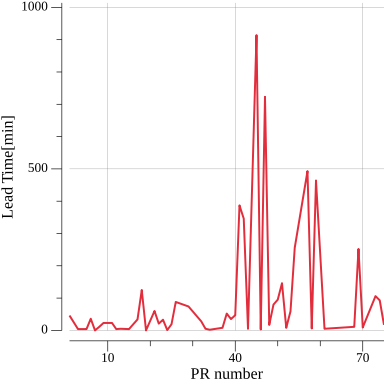

[](https://goreportcard.com/report/github.com/nao1215/leadtime)
[](https://github.com/nao1215/leadtime/actions/workflows/reviewdog.yml)
[](https://github.com/nao1215/leadtime/actions/workflows/linux_test.yml)
[](https://github.com/nao1215/leadtime/actions/workflows/mac_test.yml)
[](https://github.com/nao1215/leadtime/actions/workflows/windows_test.yml)
# leadtime - calculate GitHub PR lead time statistics
```
|------------- lead time -------------|
|               |--- time to merge ---|
---------------------------------------
^               ^                     ^
first commit    create PR          merge PR
```
leedtime is a command that outputs statistics about the time it takes for a GitHub Pull Request to be merged. The leadtime command was developed under the influence of the following books.
- Eng: [Accelerate: The Science of Lean Software and DevOps: Building and Scaling High Performing Technology Organizations](https://www.amazon.com/dp/1942788339/ref=cm_sw_r_cp_ep_dp_sBN8BbGC11MBS)
- JP: [LeanとDevOpsの科学［Accelerate］](https://www.amazon.co.jp/Lean%E3%81%A8DevOps%E3%81%AE%E7%A7%91%E5%AD%A6%EF%BC%BBAccelerate%EF%BC%BD-%E3%83%86%E3%82%AF%E3%83%8E%E3%83%AD%E3%82%B8%E3%83%BC%E3%81%AE%E6%88%A6%E7%95%A5%E7%9A%84%E6%B4%BB%E7%94%A8%E3%81%8C%E7%B5%84%E7%B9%94%E5%A4%89%E9%9D%A9%E3%82%92%E5%8A%A0%E9%80%9F%E3%81%99%E3%82%8B-impress-top-gear%E3%82%B7%E3%83%AA%E3%83%BC%E3%82%BA-ebook/dp/B07L2R3LTN)

The motivation for developing the leadtime command is to measure lead time for changes. I previously used unit test coverage as a measure of software quality. However, I felt that unless we wrote creative tests and rewrote the code, test coverage would increase but quality would not improve. 
  
Therefore, I considered measuring lead time, one of the indicators presented in the above book.

## How to install
### Use "go install"
If you does not have the golang development environment installed on your system, please install golang from the [golang official website](https://go.dev/doc/install).
```
 go install github.com/nao1215/leadtime@latest
```

### Use homebrew (aarch64)
```
$ brew tap nao1215/tap
$ brew install nao1215/tap/leadtime
```

## How to use
### Usage
```
Usage:
  leadtime stat [flags]

Examples:
  LT_GITHUB_ACCESS_TOKEN=XXX leadtime stat --owner=nao1215 --repo=sqly

Flags:
  -a, --all                    Print all data used for statistics
  -B, --exclude-bot            Exclude Pull Requests created by bots
  -P, --exclude-pr ints        Exclude specified Pull Requests (e.g. '-P 1,3,19')
  -U, --exclude-user strings   Exclude Pull Requests created by specified user (e.g. '-U nao,alice')
  -h, --help                   help for stat
  -j, --json                   Output json
  -m, --markdown               Output markdown
  -o, --owner string           Specify GitHub owner name
  -r, --repo string            Specify GitHub repository name
```

### Execution example
You need to set GitHub access token in environment variable "LT_GITHUB_ACCESS_TOKEN". If you want to check github.com/nao1215/sqly repository, you execute bellow.
```
$ leadtime stat --owner=nao1215 --repo=sqly
[statistics]
 Total PR       = 28
 Lead Time(Max) = 21144[min]
 Lead Time(Min) = 1[min]
 Lead Time(Sum) = 35310[min]
 Lead Time(Ave) = 1261.07[min]
 Lead Time(Median) = 66.50[min]
```


### json format output
If you change output format to json, you use --json option.
```
$ leadtime stat --owner=nao1215 --repo=sqly --json | jq .
{
  "total_pr": 28,
  "lead_time_maximum": 21144,
  "lead_time_minimum": 1,
  "lead_time_summation": 35310,
  "lead_time_average": 1261.0714285714287,
  "lead_time_median": 66.5
}
```

### markdown format output
If you change output format to markdown, you use --markdown option. Markdown output sample is [here](doc/sample_leadtime.md).
```
$ leadtime stat --owner=nao1215 --repo=gup --markdown
```

If you use --markdown, leadtime command output lead time line graph, like this.


### PR information used in statistics
If you want to check PR information used in statistics, you use --all option. The --all option is available for all output formats (json, markdown, default).
```
$ leadtime stat --owner=nao1215 --repo=sqly --json --all | jq .
{
  "lead_time_statistics": {
    "total_pr": 28,
    "lead_time_maximum": 21144,
    "lead_time_minimum": 1,
    "lead_time_summation": 35310,
    "lead_time_average": 1261.0714285714287,
    "lead_time_median": 66.5
  },
  "pull_requests": [
    {
      "number": 29,
      "state": "closed",
      "title": "Bump github.com/fatih/color from 1.13.0 to 1.14.1",
      "first_commit_at": "2023-01-23T20:21:58Z",
      "created_at": "2023-02-07T12:46:37Z",
      "closed_at": "2023-02-07T12:46:37Z",
      "merged_at": "2023-02-07T12:46:37Z",
      "user": {
        "name": "dependabot[bot]",
        "Bot": true
      },
      "merge_time_minutes": 21144
    },
    {
      "number": 28,
      "state": "closed",
      "title": "Change golden pacakge import path",
      "first_commit_at": "2022-12-03T09:48:37Z",
      "created_at": "2022-12-03T10:01:18Z",
      "closed_at": "2022-12-03T10:01:18Z",
      "merged_at": "2022-12-03T10:01:18Z",
      "user": {
        "name": "nao1215",
        "Bot": false
      },
      "merge_time_minutes": 12
    },
    ~~
    ~~
```

### Exclude PRs
- --exclude-bot option: Exclude Pull Requests created by bots
  ```
  leadtime stat --owner=nao1215 --repo=gup --exclude-bot
  ```

- --exclude-pr option: Exclude specified Pull Requests
  ```
  leadtime stat --owner=nao1215 --repo=gup --exclude-pr=1,3,11
  ```

- --exclude-user option: Exclude Pull Requests created by specified user
  ```
  leadtime stat --owner=nao1215 --repo=gup --exclude-user=nao,mio
  ```

## Features to be added
The leadtime command is targeted to be combined with a GitHub action to be able to look back at statistical data on GitHub. I also plan to make it possible to output the information necessary to shorten leadtime.
- [ ] CSV output format
- [x] JSON output format
- [ ] Markdown file output
- [ ] Output to file
- [ ] Supports GitHub Actions
- [x] Exclude the bot's PR
- [ ] faster by goroutine

## Contributing / Contact
First off, thanks for taking the time to contribute! heart Contributions are not only related to development. For example, GitHub Star motivates me to develop!

[](https://star-history.com/#nao1215/leadtime&Date)

  
If you would like to send comments such as "find a bug" or "request for additional features" to the developer, please use one of the following contacts.
- [GitHub Issue](https://github.com/nao1215/leadtime/issues)

## Other project
- [shibayu36/merged-pr-stat](https://github.com/shibayu36/merged-pr-stat)
- [isanasan/dmps](https://github.com/isanasan/dmps)
- [Trendyol/four-key](https://github.com/Trendyol/four-key)
- [hmiyado/four-keys](https://github.com/hmiyado/four-keys)


## LICENSE
The leadtime project is licensed under the terms of [MIT LICENSE](./LICENSE).
